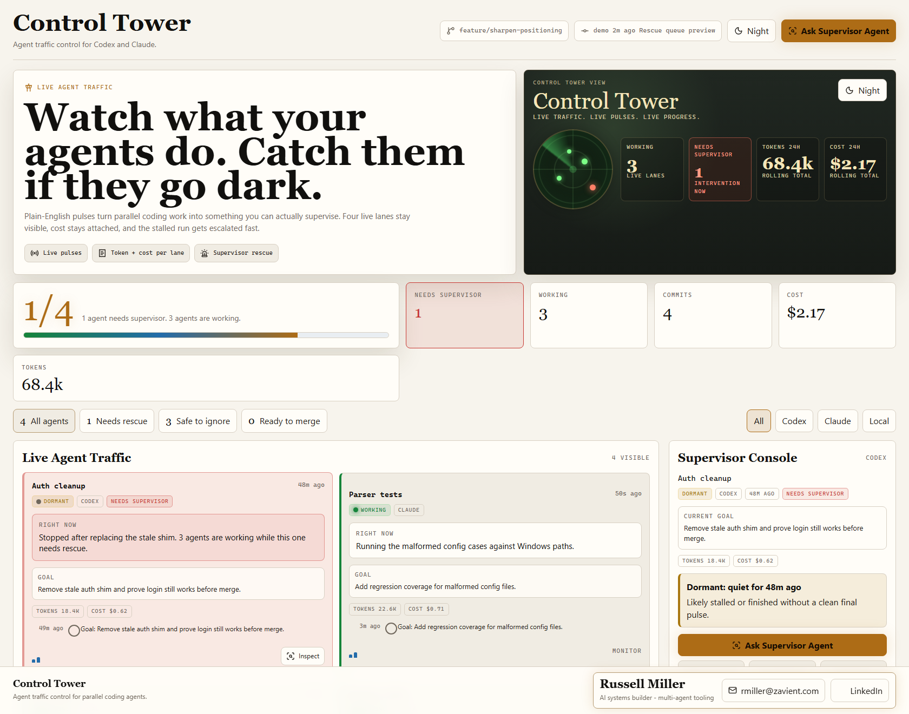

# Control Tower

Agent traffic control for Codex and Claude.

Watch what your agents do. Catch them if they go dark.

Most supervisor boards can only show what agents happen to log. Control Tower
ships the missing half: hooks that make agents emit plain-English updates in
the first place.

Those enforced updates power the useful parts: live agent status, honest
checkpoint progress, stalled-agent rescue, and token/cost visibility per agent.



## What you get

- **Hook-enforced web board at `localhost:9999`** - live agent cards, hook health, run health, and detail inspector.
- **Five hook checks** - spawn isolation, pulse contract, stop enforcement, main-thread pulses, and parallel-work nudges.
- **Supervisor Agent button** - writes a plain-English inspection request back to the right pulse log.
- **Checkpoint progress per agent** - each agent declares 3-7 concrete checkpoints, then advances a visible `current/total` progress rail as real work lands.
- **Tokens + cost per agent** - extracts usage from agent pulses and rolls it up on the dashboard.
- **Rescue queue** - ranks agents that are silent, dormant, or showing problem signals.
- **Codex + Claude source detection** - watches Windows-friendly `.codex` and `.claude` state paths automatically.
- **Light default + nixie night mode** - use the toggle or `?theme=light` / `?theme=dark` for screenshots.
- **Windows desktop + taskbar shortcut** - run the one-click installer or `scripts/create-desktop-shortcut.ps1`.
- **Agent setup skill** - `skills/control-tower-setup/SKILL.md` tells Claude or Codex how to install and verify it.
- **Static screenshot mode** - add `?static=1` so portfolio captures do not wait on the live event stream.
- **Recent commits sidebar** - live `git log` of the active branch.
- **Live SSE feed plus first-paint hydration** - events stream live, and screenshots render populated immediately.
- **Terminal watcher** as a fallback - `pulse-watch.cjs` does the same thing in a terminal window for headless use.

## Why this exists

Parallel coding agents are powerful, but they are easy to lose track of.

The usual failure mode is structural: agents only report progress when they
remember to. This project makes reporting a contract. Hooks block or nudge the
workflow until agents leave useful progress pulses behind.

The goal is simple:

- Make agent updates mandatory.
- Keep working agents visible.
- Put stalled agents at the top.
- Show tokens and cost by agent.
- Send a Supervisor Agent inspection request without hunting through logs.

## What the hooks enforce

| Hook | Event | What it enforces |
| --- | --- | --- |
| `worktree-on-agent-spawn.mjs` | PreToolUse on Agent | Blocks agent spawns without worktree isolation unless explicitly opted out. |
| `pulse-on-agent-activity.mjs` | PreToolUse on Agent | Blocks agent briefs that do not reference the pulse contract, then emits the baseline goal pulse. |
| `pulse-enforcer-subagent.mjs` | Stop | Refuses silent subagent stops unless at least one narrative pulse landed. |
| `main-thread-pulse.mjs` | PostToolUse on edits/tests/builds | Emits main-thread progress after commits, tests, builds, and edits. |
| `parallel-when-possible.mjs` | Stop | Nudges the orchestrator to spawn more agents when parallel-safe work is waiting. |

## How it works (30 seconds)

1. Agents append plain-English progress events to a shared log file: `~/.claude/state/agent-pulse.log`. One line per event, format:
   ```
   [2026-05-13T15:34:08Z] [Phase 3] Agent: Wrote the failing test. Tokens: 12,480. Cost: $0.42.
   ```
2. The dashboard server tails that file and pushes events to your browser via SSE.
3. The hooks make agents actually write pulses (refuse spawn or stop otherwise).
4. You watch your browser tab. No polling. No "let me check status" round-trips.

## Quick start

### Install on Windows

Double-click:

```text
Install Control Tower.cmd
```

Or run:

```powershell
powershell -NoProfile -ExecutionPolicy Bypass -File ".\Install Control Tower.ps1"
```

That installs the hooks and creates a desktop + taskbar shortcut named `Control Tower`.

The Windows launcher opens Control Tower in a dedicated app window so the icon
shows up in the browser chrome and on the taskbar too.

### Install on macOS / Linux

```bash
git clone https://github.com/russellmiller3/control-tower.git control-tower
cd control-tower
./scripts/install.sh
```

The installer:
1. Copies the 5 hook files into `~/.claude/hooks/`
2. Patches `~/.claude/settings.json` to wire them up (with a `.bak` backup of the original)
3. Creates `~/.claude/state/agent-pulse.log` if it doesn't exist

On Windows, the one-click installer also creates the desktop shortcut.

### Run the dashboard

```bash
node dashboard/server.cjs
```

Open `http://localhost:9999` in your browser. Leave the tab open.

Optional environment variables:

```powershell
$env:CONTROL_TOWER_PORT="9999"
$env:CONTROL_TOWER_REPO="C:\Users\rmill\Desktop\programming\clear"
$env:AGENT_PULSE_LOG="C:\path\to\agent-pulse.log"
node dashboard/server.cjs
```

Control Tower also accepts the older `AGENT_DASHBOARD_PORT` and
`AGENT_DASHBOARD_REPO` names for one release so existing shortcuts do not
break mid-upgrade.

By default the server watches:
- `%USERPROFILE%\.codex\state\agent-pulse.log`
- `%USERPROFILE%\.claude\state\agent-pulse.log`
- `.\agent-pulse.log`

That means the dashboard works on Windows with Codex as soon as Codex, a hook, or a harness writes the same pulse format.

### Use it with Claude Code

In a fresh Claude Code session, paste the contents of `SETUP-PROMPT.md` as your first message. Claude will:
- Verify the hooks are wired
- Read the pulse contract
- Confirm it understands the orchestrator-emit-Goal-first rule

Then ask Claude to do anything that involves background agents. The hooks enforce the rest.

### Use the setup skill

The repo includes `skills/control-tower-setup/SKILL.md`.

Give that skill to Claude or Codex when you want the agent to:
- Install the hooks
- Create the Windows desktop + taskbar shortcut
- Launch the dashboard
- Verify the demo preview
- Confirm checkpoint progress, tokens, costs, rescue, and footer contact details render

### Use it with Codex, Claude Cowork, or other agent tools

The bundled hook layer is Claude Code-specific today, but the dashboard works with **any** agent system that can append to an agent pulse log in the expected format. For Codex or Cowork:

1. Skip the Claude hook installer step unless you are using Claude Code.
2. Run the dashboard server.
3. Have the agent, hook, or harness append events to one of the watched pulse logs. Format:
   ```
   [<ISO timestamp>] [<task name>] Agent: <plain English status>
   ```
4. Same dashboard, same view.

The dashboard is platform-agnostic by design. The hooks are the accelerator, not the dependency.

## What "plain English" means

The dashboard reads the agent's events directly to you. If your agent writes `parseHumanConfirm() now accepts graduation metadata via _grade flag` you'll see exactly that. To make the dashboard valuable, agents need to emit **plain-English narrative**, not jargon.

The pulse contract enforces this:
- No function names (`_askAI`, `parseHumanConfirm`)
- No file paths (`parser.js:8682`)
- No commit SHAs in event bodies
- No bare cycle numbers as the headline
- 14-year-old test: would someone who isn't reading the source understand?

Full rules + examples in `AGENT-PULSE-CONTRACT.md`.

## Files in this repo

```
control-tower/
|-- README.md
|-- Install Control Tower.cmd        # double-click Windows installer
|-- Install Control Tower.ps1        # one-click PowerShell installer
|-- SETUP-PROMPT.md                  # paste into Claude Code to wire it up
|-- AGENT-PULSE-CONTRACT.md          # pulse format spec for agents
|-- LICENSE.md                       # Fair Source: free personal, paid commercial
|-- dashboard/
|   |-- server.cjs                   # Node HTTP + SSE server, port 9999, zero deps
|   `-- index.html                   # single-file UI, Lucide icons, light/night mode
|-- hooks/
|   |-- worktree-on-agent-spawn.mjs  # refuses unisolated agent spawns
|   |-- pulse-on-agent-activity.mjs  # gates spawn + ambient pulse emission
|   |-- pulse-enforcer-subagent.mjs  # refuses silent agent stops
|   |-- main-thread-pulse.mjs        # emits progress after edits, tests, builds
|   `-- parallel-when-possible.mjs   # nudges toward parallel agent dispatch
|-- scripts/
|   |-- install.sh                   # macOS / Linux installer
|   |-- install.ps1                  # Windows PowerShell installer
|   |-- create-desktop-shortcut.ps1  # Windows desktop + taskbar shortcut creator
|   |-- launch-control-tower.ps1     # Windows launcher used by the shortcut
|   `-- pulse-watch.cjs              # terminal alternative to the web UI
`-- skills/
    `-- control-tower-setup/
        `-- SKILL.md                 # setup skill for Claude/Codex
```

## Licensing & pricing

**Free for personal use.** Indie projects, learning, hobby work, your own toolchain - go nuts.

**Commercial use requires a license.** If you or your company uses this dashboard for work that generates revenue, you need a commercial license:

- **Solo / freelance** (you work for yourself, < $1M ARR): **free** - same as personal
- **Team** (1-50 seats, employer-paid): **$8 per seat per month** - covers small teams that want to coordinate Claude Code work across multiple agents
- **Enterprise** (50+ seats, audit logs, SSO, on-prem): **contact for pricing**

Email **rmiller@zavient.com** to license commercial use.

Why this model: this dashboard is the kind of thing a solo dev would gladly build for themselves, but engineering teams running multiple Claude agents in coordinated workflows get real production-grade value from it. Fair Source keeps the personal-use door wide open while making the commercial track honest.

## Usage and telemetry

Downloadable tools cannot prove perfect usage by themselves. The practical model:

1. **Track purchases first.** Sell a license and monitor paid seats.
2. **Track release downloads.** GitHub release assets give a rough download count.
3. **Use license activation for paid seats.** Ask for a key during install, validate it periodically, and allow offline grace.
4. **Disclose telemetry plainly.** If the app phones home, say exactly what it sends.
5. **Do not block local use casually.** This is a developer tool; trust matters.

The first paid version should sell the license, support, and team workflow. Metered usage can wait until there is real demand.

What is safe to send:
- License id or hashed license key
- App version
- OS
- Anonymous install id
- Event type: install, launch, validate, deactivate

What should never leave the machine:
- Prompt text
- Agent messages
- Pulse logs
- Repo paths
- File names
- Source code

Commercial builds should say this plainly:

> Commercial builds use license activation to count seats. No agent logs or source-code data leave your machine.

See `LICENSE.md` for the formal license text.

## Built by

**Russell Miller** - [rmiller@zavient.com](mailto:rmiller@zavient.com) - [LinkedIn](https://www.linkedin.com/in/russellmiller) - [GitHub](https://github.com/russellmiller3)

If this saves you time, tell people. Pull requests welcome.
